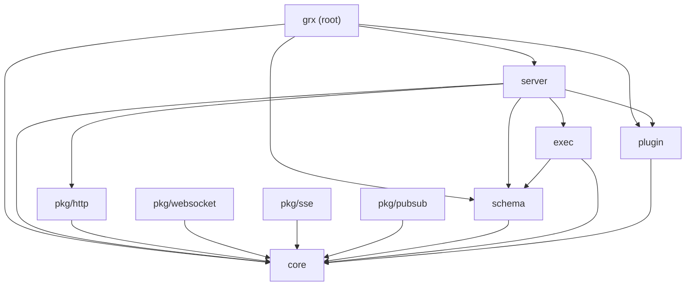

grx is a single Go module organised into a small number of packages,
each with a tightly-scoped responsibility. The layering is deliberate:
packages on the inside have no idea packages on the outside exist.

## Package layout

| Package              | Role                                                                                                       |
| -------------------- | ---------------------------------------------------------------------------------------------------------- |
| `grx` (root)         | Top-level entry point: `grx.NewServer` with options such as `WithSchema`, `WithPlugins`, `WithPlaygroundPath`, optional `WithGraphQLPath` / `WithSubscriptionPath`, and `WithTransports`. |
| `core`               | Shared types: `Request`, `Response`, `Error`, `Executor`, `Transport`, `OperationKind`. No upward imports. |
| `schema`             | Reflects user Go types (root `Query`, `Mutation`, `Subscription`, inputs, outputs) into runtime metadata.  |
| `exec`               | Lexer, parser, AST, executor, and the introspection fast-path. The hot path lives here.                    |
| `server`             | `http.Handler`, GraphiQL playground, transport dispatch. Auto-appends `pkg/http` so `POST /graphql` works. |
| `plugin`             | Lifecycle hooks (`RequestStart`, `ParsingStart`, …) plus built-in plugins like `plugin/logger`.            |
| `pkg/http`           | GraphQL-over-HTTP+JSON transport. Auto-appended by `grx.NewServer`; package name `http` (alias as `grxhttp`). |
| `pkg/websocket`      | RFC 6455 WebSocket framing plus the `graphql-transport-ws` subprotocol.                                    |
| `pkg/sse`            | GraphQL over Server-Sent Events transport.                                                                 |
| `pkg/pubsub`         | Optional publish/subscribe primitive for cross-resolver subscription fan-out. Only needed when subscriptions consume mutation events. |
| `pkg/pubsub/redis`   | Redis-backed `PubSub` implementation. Separate Go module so the root stays dependency-free.                |

## Layering rules

The non-negotiable rules:

- **`core` has no upward imports.** It must not import `schema`, `exec`,
  `server`, `plugin`, or anything under `pkg/`. Subpackages under
  `pkg/` may import `core` but follow the same upward-import ban.
- **Every network protocol — including HTTP+JSON — implements
  `core.Transport`** and lives under `pkg/`. The `server` package wires
  user-supplied transports in via `Config.Transports` and appends the
  default `pkg/http` transport at the end of the chain. The `server`
  package itself never touches the GraphQL request body; it only owns
  routing, the playground, and `/favicon.ico`.
- **`exec` owns parsing, validation, execution, and introspection.** It
  is transport-agnostic.
- **`schema` is the only package allowed to use reflection-heavy
  introspection.** Reflection runs once at startup and is cached so
  `exec` can stay allocation-aware on the hot path.
- **No third-party runtime dependencies in the root module.** The
  standard library does the work. Optional integrations (Redis pubsub
  today, more later) live in their own Go submodules under `pkg/`.

## Request lifecycle

A typical query travels through these stages:

1. **Transport match.** `server.ServeHTTP` consults each registered
   `core.Transport` in order. The first one whose `Match` returns true
   takes ownership of the response. The default `pkg/http` transport
   is appended to the chain by `grx.NewServer`, so plain `POST /graphql`
   requests always find a handler without explicit registration.
2. **Decode.** The transport decodes its wire format into a
   `core.Request`.
3. **Plugin: `RequestStart`.** The only plugin hook allowed to return
   a derived `context.Context`.
4. **Parse.** `exec.Parser` produces an AST. `ParsingStart` fires.
5. **Validate.** Spec validation rules run. `ValidationStart` fires.
6. **Execute.** `exec.Executor` resolves fields, calling user methods
   via precomputed metadata from `schema`. `ExecutionStart` and
   `FieldResolveStart` fire.
7. **Respond.** The transport serialises the `core.Response` and sends
   it. `ResponseSend` fires.
8. **Errors.** Any `error` from the pipeline triggers `Plugin.Error` so
   observability stacks can record it.

Subscriptions follow the same shape, but the response is a stream: the
executor returns a Go channel and the transport pumps values to the
client until the context is cancelled. See
[Subscriptions](/concepts/subscriptions) and [Pub/Sub](/concepts/pubsub)
for how mutation resolvers feed events to subscription resolvers.

## Performance posture

grx aims to keep hot paths predictable:

- Schema metadata is precomputed and cached.
- Reflection is forbidden inside `exec`.
- Transports talk to `core.Executor` only — they never reach into
  `schema` or build response shapes themselves.
- Per-request plugin state belongs in the `context.Context`, not on
  plugin structs (so plugins are safe across goroutines).

See the [Roadmap](/roadmap) for the performance requirements in full.
