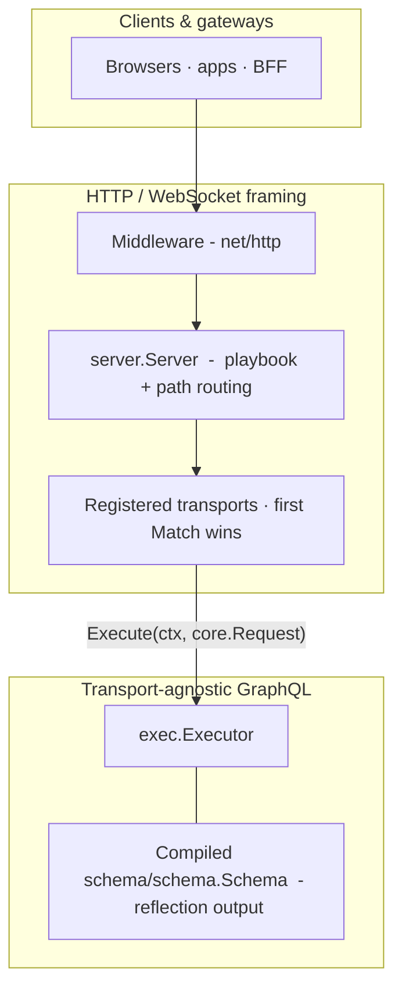
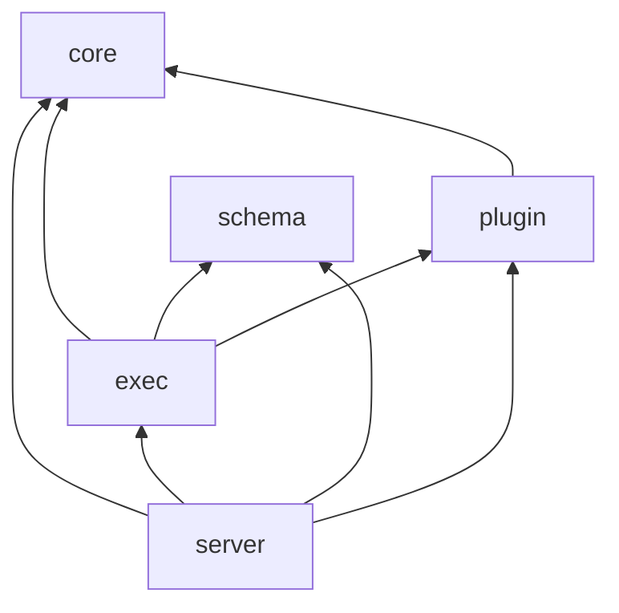

# How it fits together

This page is the **systems view**: what owns the network edge, where GraphQL stops being HTTP, how packages depend on each other, and where you extend behavior without rewriting the executor. Pair it with [Define your schema](/concepts/schema-basics) when you mostly care about resolver shape, or [Execution pipeline](/concepts/execution) when you want stage-by-stage detail.

---

## Layers at runtime

Roughly everything in **HTTP / WebSocket framing** touches **TCP**, **headers**, or **`Match`/`Serve`**. Inside **Transport-agnostic GraphQL** the executor only sees [`core.Request`](https://pkg.go.dev/github.com/grx-gql/grx/core#Request)  -  the intentional split so the same engine runs behind CLI tools, tests, WebSockets, SSE, or a bespoke gateway.

**Important boundary:** middleware works on [`http.Request`](https://pkg.go.dev/net/http#Request) (headers, cookies, trailers). [`core.Request`](https://pkg.go.dev/github.com/grx-gql/grx/core#Request) deliberately carries **only** `query`, `operationName`, and `variables`  -  so JWT or Bearer parsing stays in middleware (or upstream proxies), attaching identity onto [`context.Context`](https://pkg.go.dev/context#Context) before the transport calls `Execute`. More on security wiring in [Authentication & authorization](/guides/auth).

---

## Package layers (imports)

[**`core`**](/reference/core/) is the thin **ABI** between transports and execution: [`Request`](https://pkg.go.dev/github.com/grx-gql/grx/core#Request) / [`Response`](https://pkg.go.dev/github.com/grx-gql/grx/core#Response), the [`Executor`](https://pkg.go.dev/github.com/grx-gql/grx/core#Executor) interface, and [`Transport`](https://pkg.go.dev/github.com/grx-gql/grx/core#Transport). The package deliberately **imports nothing upward** (`exec`, `schema`, `server`, … stay out), so wiring stays acyclic while every adapter shares the same types.

[**`schema`**](/reference/schema/) describes how Go types compile into GraphQL metadata (mostly at **startup**).

[**`exec`**](/reference/exec/) implements parsing, validation, execution, and subscription streaming.

[**`plugin`**](/reference/plugin/) defines lifecycle hooks the executor invokes in order  -  logging, denial, enrichment.

[**`server`**](/reference/server/) is the **`http.Handler`**: multiplexes playground, transports, timeouts, masking, persisted queries  -  then hands work to transports + executor.

**[Companion packages](/reference/)** such as **`http`**, **`websocket`**, **`sse`**, and **`memory-pubsub`** implement the official **`core.Transport`** surfaces.

`grx` is a thin **facade**: [`NewServer`](https://pkg.go.dev/github.com/grx-gql/grx#NewServer) and options map onto [`server.Config`](https://pkg.go.dev/github.com/grx-gql/grx/server#Config).

---

## Two clocks: startup vs each request

| Phase | What happens |
| ----- | ------------- |
| **Process startup** | Your `schema.Config` (resolver roots + optional enums/unions/etc.) is **reflected once** into a [`schema.Schema`](https://pkg.go.dev/github.com/grx-gql/grx/schema#Schema) artifact; an [`exec.Executor`](https://pkg.go.dev/github.com/grx-gql/grx/exec#Executor) binds that metadata with plugins and policy hooks; [`server.New`](https://pkg.go.dev/github.com/grx-gql/grx/server#New) wraps the executor and registers transports (`http` is auto-appended on the GraphQL path unless you customise ordering). |
| **Each GraphQL operation** | A transport parses the wire format → builds `core.Request` → invokes `executor.Execute(ctx, req)` **or** `Subscribe` → response bytes go back through the transport. No full schema rebuild; per-request CPU is dominated by lex/parse/validate/execute unless you explicitly cache fragments or APQ payloads. |

That split is why resolvers receive **frozen** schema metadata via the executor and **fresh** [`context.Context`](https://pkg.go.dev/context#Context) values (deadlines, cancellations, middleware-scoped identity).

---

## Path routing in one glance

[`server.Config`](/reference/server/#Config):

- **`GraphQLPath`** (default `/graphql`)  -  HTTP JSON queries/mutations (`POST`) always land here thanks to the default `http` transport placed at the tail of that chain unless you reorganise transports.
- **`SubscriptionPath`**  -  when unset, WebSocket/SSE transports share **`GraphQLPath`** (usual GraphiQL + `graphql-transport-ws` setup). When it **differs**, only concrete bundled `*websocket.WebSocketTransport` / `*sse.Transport` registrations move  -  custom transports stay wherever you routed them unless you mimic that split yourself.

Ordering rule: transports are scanned **registration order**, first **`Match`** wins. See [Routers & transports](/concepts/transports).

---

## Where to intervene (extension points)

Pick the cheapest layer  -  don’t put HTTP concerns inside resolvers unless you truly need to.

| Need | Prefer | Nuance |
| ---- | ------ | ------ |
| CORS, auth headers, JWT on `ctx` | [`WithMiddleware`](/reference/grx/) wrapping the final [`http.Handler`](https://pkg.go.dev/net/http#Handler) | Runs before transports; propagate with `r.WithContext`. |
| New wire format or bespoke gateway | Implement [`core.Transport`](/reference/core/) | **`Match`** must stay cheap & side‑effect‑free  -  see [Custom transport](/guides/custom-transport). |
| Lifecycle logging, quotas, coarse deny | [`WithPlugins`](/reference/grx/) implementing [`plugin.Plugin`](/reference/plugin/)  -  [Hooks](/concepts/plugins) | `RequestStart` can replace `ctx`; hooks can abort before expensive work. |
| “No mutations anonymous” blanket rule | [`WithOperationAuthorizer`](/reference/grx/)  -  also [Authentication guide](/guides/auth) | Evaluated during document validation (alongside trusted-doc / rate‑limit knobs on server config when enabled). |
| Per-field secrecy / tenancy | [`WithFieldAuthorizer`](/reference/grx/) | Paths are GraphQL paths; rejects before coercion + resolver. |
| Deadline on every operation | [`WithRequestTimeout`](/reference/grx/) | Deadline applies inside built-in transports calling `Execute` / subscription setup  -  wire your own timeouts if you replace transports. |

---

## Operation flow (mental checklist)

Once a subscription or query reaches the executor, the condensed story matches the [**Execution pipeline**](/concepts/execution): **Lex → Parse → Validate → Execute** (+ plugin taps between stages). Streaming responses simply repeat emission per subscription event according to transport rules documented under [Subscriptions](/concepts/subscriptions) and realtime [guides](/guides/subscriptions).

If you benchmark or profile, distinguish **cold parse** versus **steady-state** workloads  -  see the [Benchmarks](/benchmarks) page and sibling `benchmark/` module in the repository for comparisons with other Go GraphQL stacks.

---

## Related reading

- [Execution pipeline](/concepts/execution)  -  stages, caches, hooks, executor limits  
- [Routers & transports](/concepts/transports)  -  path splits, WS/SSE, registration order  
- [Hooks & plugins](/concepts/plugins)  -  lifecycle and plugin vs HTTP middleware  
- [Pub/Sub](/concepts/pubsub)  -  bridging mutations and subscriptions  
- [API reference overview](/reference/)  -  package finder  
- [Roadmap](/roadmap)  -  spec surface and internals tracker  
