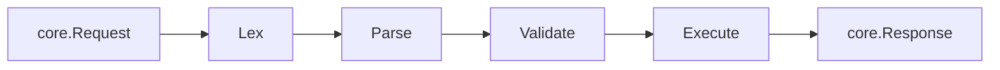

# Execution pipeline

The `exec` package owns the GraphQL hot path: lex, parse, validate,
execute. It is intentionally transport-agnostic — it sees a `core.Request`
in, returns a `core.Response` (or a stream of them, for subscriptions) out.

## Pipeline

Each stage emits a plugin hook (`ParsingStart`, `ValidationStart`,
`ExecutionStart`, `FieldResolveStart`) so observability and security
plugins can react without touching the executor.

## Lex and parse

The lexer recognises the full GraphQL October 2021 token set
(names, numbers, block strings, escapes, punctuators) and emits typed
tokens. The parser builds an AST of operations and selection sets.

Today the parser supports anonymous and named queries, mutations,
subscriptions, fragments (named spreads and inline), field aliases, list and
object literal values, scalar arguments, and variable references. Variable
references are tracked with source locations so validation can enforce GraphQL's
variable rules after the request map is known. The
[Roadmap](/roadmap) tracks remaining grammar and SDL work.

## Validation

Validation runs before execution and is responsible for catching
spec-defined errors at the request boundary so resolvers can assume their
inputs are well-typed. Current rules include (non-exhaustively): executable
definitions, lone anonymous operation, unique operation names, fragment rules,
directive locations and uniqueness, sibling field merge conflicts for the same
response key, variable definitions vs `$` uses (every reference declared, every
declaration used), required arguments on fields, and typed arguments on the
built-in executable directives the runtime recognises (`@skip`, `@include`,
`@defer`, and `@stream`).

For schema-side introspection builtins (**`@deprecated`**, **`@specifiedBy`**, **`@oneOf`**) plus HTTP **`multipart/mixed`** behaviour, see **[Built-in directives](/guides/schema-directives)**.

## Execute

For each field in the operation:

1. Look up the resolver method on the precomputed schema metadata.
2. Decode arguments from the parsed AST and request variables into the
   resolver's `args` struct.
3. Call the resolver with `(ctx, args)`, omitting either if the signature
   doesn't take it.
4. Walk the returned value, recursing into nested object types until every
   selected leaf has a concrete value.
5. Bubble errors per the GraphQL spec: a field error nulls the field and
   records `errors[].path`, leaving siblings intact.

For subscriptions, the executor calls the resolver once to obtain the
source stream channel. Each value received from the channel is then
treated as the source for a new field-execution pass and emitted to the
transport.

## Document shape limits and parse cache

Beyond parse-time selection depth (`exec.WithMaxSelectionDepth` / server wiring),
the executor can reject oversized operations before running resolvers:

- **Total selections** — `exec.WithMaxSelectionCount` / `server.Config.MaxSelectionCount`
- **Aliased fields** — `exec.WithMaxAliasCount` / `server.Config.MaxAliasCount`
- **Top-level fields** — `exec.WithMaxRootFieldCount` / `server.Config.MaxRootFieldCount`

Zero disables each limit. These are coarse guards against denial-of-service
shapes; they are not a full GraphQL "cost" or complexity analysis.

For **variable-free** requests, `exec.WithDocumentCache` /
`server.Config.DocumentCacheSize` enables a bounded in-memory cache of parsed
document bundles (eviction is FIFO by insertion order when full). Requests that
supply a variable map skip the cache because variable defaults are still applied
during parsing.

Additionally, `exec.WithLexerCache` / `server.Config.LexerCacheSize` caches the
lexical `[]token` stream per normalized query text. **When `DocumentCacheSize` is
positive and `LexerCacheSize` is zero, the HTTP server uses the same capacity
for both**, so GraphQL-over-HTTP handlers that call `OperationKind` before
`Execute` do not pay two full lex passes. Cached token slices are immutable;
the parser keeps its own index into the shared slice.

## Introspection

`__schema` and `__type(name:)` are served by a dedicated introspection
implementation so GraphiQL and other introspecting clients work out of the
box. A slower, fully spec-compliant path that exposes introspection as
ordinary schema fields is on the roadmap. To disable introspection in
deployments, configure **`DisableIntrospection`** / **`grx.WithDisableIntrospection`**
(**[Introspection guide](/guides/introspection#disable-introspection)**).

## What it doesn't do (yet)

- Variable and value validation is not yet complete vs the full GraphQL spec
  (see the [Roadmap](/roadmap) validation section).

Each completed roadmap item reflects behaviour covered by tests in the repository.
