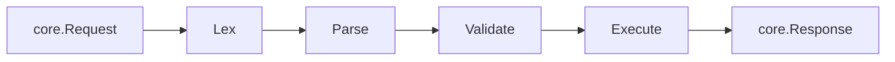

The `exec` package owns the GraphQL hot path: lex, parse, validate,
execute. It is intentionally transport-agnostic — it sees a `core.Request`
in, returns a `core.Response` (or a stream of them, for subscriptions) out.

## Pipeline

Each stage emits a plugin hook (`ParsingStart`, `ValidationStart`,
`ExecutionStart`, `FieldResolveStart`) so observability and security
plugins can react without touching the executor.

## Lex and parse

The lexer recognises the full GraphQL October 2021 token set
(names, numbers, block strings, escapes, punctuators) and emits typed
tokens. The parser builds an AST of operations and selection sets.

Today the parser supports anonymous and named queries, mutations,
subscriptions, list and object literal values, and scalar arguments. The
[Implementation Checklist](https://github.com/patrickkabwe/grx#graphql-parser)
tracks the remaining grammar work (fragments, directives, full SDL, …).

## Validation

Validation runs before execution and is responsible for catching
spec-defined errors at the request boundary so resolvers can assume their
inputs are well-typed. The current set of validation rules is being filled
in alongside the parser (see the
[Validation section](https://github.com/patrickkabwe/grx#validation) of
the checklist).

## Execute

For each field in the operation:

1. Look up the resolver method on the precomputed schema metadata.
2. Decode arguments from the parsed AST and request variables into the
   resolver's `args` struct.
3. Call the resolver with `(ctx, args)`, omitting either if the signature
   doesn't take it.
4. Walk the returned value, recursing into nested object types until every
   selected leaf has a concrete value.
5. Bubble errors per the GraphQL spec: a field error nulls the field and
   records `errors[].path`, leaving siblings intact.

For subscriptions, the executor calls the resolver once to obtain the
source stream channel. Each value received from the channel is then
treated as the source for a new field-execution pass and emitted to the
transport.

## Introspection

`__schema` and `__type(name:)` are served by a fast-path implementation in
`exec/introspection.go` so GraphiQL and other introspecting clients work
out of the box. The slower, fully spec-compliant implementation that
exposes introspection as normal schema fields is on the roadmap.

## What it doesn't do (yet)

The most visible gaps in execution today:

- No fragment collection, inline fragments, or `@skip` / `@include`.
- Field aliases are not yet honoured.
- Non-null bubbling is not implemented; nulls in non-null positions can
  leak through.
- No serial-mutation guarantee or parallel-query field execution.
- No request-scoped resolver cache (DataLoader-style batching is planned).

These are all tracked under
[Execution](https://github.com/patrickkabwe/grx#execution) in the
checklist. Each completed item there reflects real, tested behaviour in
this package.
